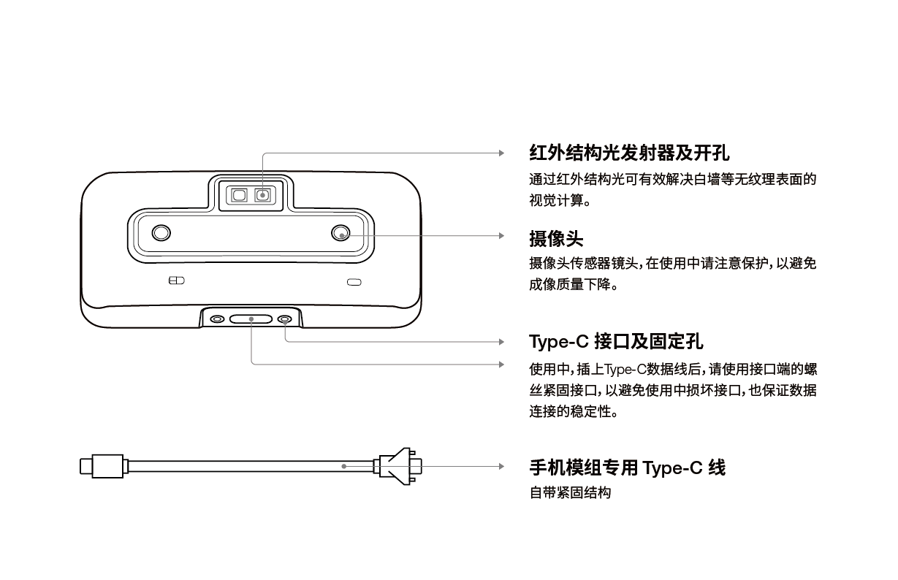

.. _surface_d1200:

D1200 尺寸与结构
====================

=============== ==========
外壳(mm)          PCBA板(mm)
=============== ==========
75.5x34.5x12.9   58.1x29.5
=============== ==========

A. 摄像头：摄像头传感器镜头，在使用中请注意保护，以避免成像质量下降。

B. 红外结构光发射器及开孔：通过红外结构光可有效解决白墙等无纹理表面的视觉计算。(非
IR 版，此孔保留，但内部无结构光发射装置)

C. type-c口连接。

