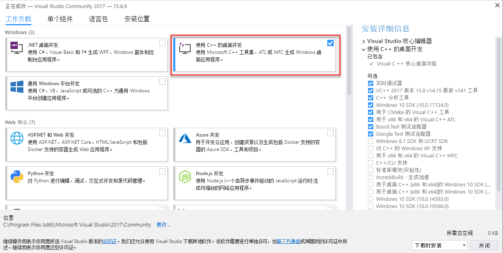

.. _sdk_install_win_src:

Windows 源码安装
====================

以下源码编译安装过程。如果只需使用预编译好的库，请参考 :ref:`sdk_install_win_exe`。

1. 安装编译工具
---------------

1.1 安装 Visual Studio
~~~~~~~~~~~~~~~~~~~~~~

从 https://visualstudio.microsoft.com/zh-hans/vs/older-downloads/ 下载并安装。选择c++桌面开发，下载

.. tip::

   支持Visual Studio 2015 和 Visual Studio 2017.

1.2 安装 CMake
~~~~~~~~~~~~~~

从 https://cmake.org/ 下载并安装

1.3 安装 MSYS2
~~~~~~~~~~~~~~

1) 从 http://mirrors.ustc.edu.cn/msys2/distrib/x86_64/ 下载并安装

2) 将 bin 目录的路径添加到系统变量的 PATH 变量列表中 ( `如何添加系统变量 <https://jingyan.baidu.com/article/47a29f24610740c0142399ea.html>`__ )

.. code-block:: bat

   C:\msys64\usr\bin

3) 安装 make ,双击 msys2.exe ,输入下面的命令:

.. code-block:: bat

   pacman -Syu
   pacman -S make

安装完成后，可在命令行提示符（Command Prompt）里运行如下命令：

.. code-block:: bat

   >make --version
   GNU Make 4.2.1

2. 安装 SDK 依赖
----------------

2.1 安装 OpenCV
~~~~~~~~~~~~~~~

2.1.1 用预先建立的库安装OpenCV (Recommend)
^^^^^^^^^^^^^^^^^^^^^^^^^^^^^^^^^^^^^^^^^^

*更多信息您可以参考 `OpenCV 官方文档 <https://docs.opencv.org/3.4.2/d3/d52/tutorial_windows_install.html>`_ *

1) 进入 OpenCV 源码页
   http://sourceforge.net/projects/opencvlibrary/files/opencv-win/
2) 下载一个您想要安装的安装包. 例如 3.4.2/opencv-3.4.2-vc14_vc15.exe
3) 使用管理员权限运行安装包
4) 安装完成之后，设置 OpenCV 环境变量并添加到系统的 path 变量中

2.1.2 设置环境变量
^^^^^^^^^^^^^^^^^^

1.使用管理员权限开启 cmd,  输入以下命令来添加OPENCV_DIR变量到系统变量中:

*将 “D:\OpenCV” 替换为您自己的解压缩目录*

.. code-block:: bat

   setx -m OPENCV_DIR D:\OpenCV\Build\x64\vc14\lib     (Visual Studio 2015 使用该命令)
   setx -m OPENCV_DIR D:\OpenCV\Build\x64\vc15\lib     (Visual Studio 2017 使用该命令)

也可以参考 `如何添加系统变量 <https://jingyan.baidu.com/article/47a29f24610740c0142399ea.html>`_ 将变量手动添加。

.. code-block:: bat

   D:\OpenCV\Build\x64\vc14\lib     (Visual Studio 2015 使用该路径)
   D:\OpenCV\Build\x64\vc15\lib     (Visual Studio 2017 使用该路径)

2.将 OpenCV bin 路径添加到系统环境变量的 PATH 变量列表中

.. code-block:: bat

   D:\OpenCV\Build\x64\vc14\bin     (Visual Studio 2015 使用该路径)
   D:\OpenCV\Build\x64\vc15\bin     (Visual Studio 2017 使用该路径)

2.2 安装 libjpeg-turbo
~~~~~~~~~~~~~~~~~~~~~~

1) 从 https://sourceforge.net/projects/libjpeg-turbo/files/ 下载
   libjpeg-turbo 并安装

2) 将 bin 目录的路径添加到系统变量的 PATH 变量列表中

.. code-block:: bat

   C:\libjpeg-turbo64\bin

2.3 安装点云例程依赖的 PCL 库 (可选)
~~~~~~~~~~~~~~~~~~~~~~~~~~~~~~~~~~~~

从 https://github.com/PointCloudLibrary/pcl/releases
下载集成安装程序(PCL + dependencies)

3. 编译 SDK
-----------

打开 “x64 Native Tools Command Prompt for VS 2017”(适用于 VS 2017 的 x64
本机工具命令提示) 命令行界面

.. code-block:: bat

   git clone https://github.com/slightech/MYNT-EYE-D-SDK.git
   cd MYNT-EYE-D-SDK
   make all

.. tip::

   Visual Studio Command Prompt 可以从开始菜单打开，

  .. image:: ../static/images/sdk/vs_cmd_menu.png
    :width: 30%

  也可以从 Visual Studio 的工具菜单里打开，

  .. image:: ../static/images/sdk/vs_cmd.png
    :width: 40%

  但如 Visual Studio 2015 工具菜单里可能没有，可以自己添加个。

  打开 Tools 的 External Tools… ，然后 Add 如下内容：

  ================= =======================================================================================
  Field             Value
  ================= =======================================================================================
  Title             Visual Studio Command Prompt
  Command           ``C:\Windows\System32\cmd.exe``
  Arguments         ``/k "C:\Program Files (x86)\Microsoft Visual Studio 14.0\Common7\Tools\VsDevCmd.bat"``
  Initial Directory ``$(SolutionDir)``
  ================= =======================================================================================

4. 运行例程
-----------

.. Note::
   默认打开矫正后的图像。(跑vio时需要使用原图，跑深度或者点云使用矫正后的图像)

1) get_image 显示左目的图像和彩色深度图 (兼容USB2.0)

.. code-block:: bat

   .\samples\_output\bin\get_image.bat

2) get_stereo_image 显示左右目的图像和彩色深度图

.. code-block:: bat

   .\samples\_output\bin\get_stereo_image.bat

3) get_depth 显示左目的图像，16UC1的深度图和鼠标选中的像素的深度值(mm)

.. code-block:: bat

   .\samples\_output\bin\get_depth.bat

4) get_points 显示左目的图像，16UC1的深度图和点云

.. code-block:: bat

   .\samples\_output\bin\get_points.bat

5) get_imu 打印 imu 数据

.. code-block:: bat

   .\samples\_output\bin\get_imu

6) get_img_params 打印相机参数并保存在文件中

.. code-block:: bat

   .\samples\_output\bin\get_img_params

7) get_imu_params 打印 imu 参数并保存在文件中

.. code-block:: bat

   .\samples\_output\bin\get_imu_params

8) get_from_callbacks 使用回调方式获取图像和 imu 数据

.. code-block:: bat

   .\samples\_output\bin\get_from_callbacks

9) get_all_with_options 使用不同参数打开设备

.. code-block:: bat

   .\samples\_output\bin\get_all_with_options

10) get_depth_with_filter 显示滤波后的深度图像

.. code-block:: bat

  .\samples\_output\bin\get_depth_with_filter

11) get_points_with_filter 显示滤波后的点云图像

.. code-block:: bat

  .\samples\_output\bin\get_points_with_filter

5. 清理
-------

.. code-block:: bat

   cd <sdk>   #<sdk>为SDK所在路径
   make cleanall
